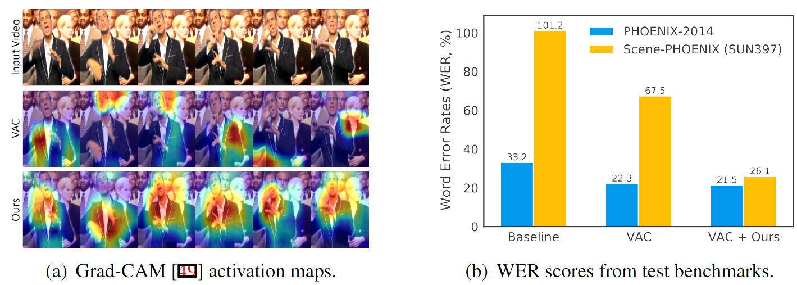

# Signing Outside the Studio: Benchmarking Background Robust Continuous Sign Language Recognition

This repository provides the official pytorch implementation of our paper:

> [Signing Outside the Studio: Benchmarking Background Robustness for Continuous Sign Language Recognition](https://arxiv.org/abs/2211.00448) 
>
> [Youngjoon Jang](https://art-jang.github.io/), [Youngtaek Oh](https://ytaek-oh.github.io), [Jae Won Cho](https://chojw.github.io/), [Dong-Jin Kim](https://sites.google.com/site/djkimcv/), [Joon Son Chung](https://mm.kaist.ac.kr/joon/), [In So Kweon](http://rcv.kaist.ac.kr/index.php?mid=rcv_faculty)
> 
> BMVC 2022

[[Paper]](https://arxiv.org/abs/2211.00448)  [[Project Page]](https://art-jang.github.io/signing_outside)

This code includes two functionalities: (1) an algorithm to automatically and deterministically generate the proposed  Scene-PHOENIX benchmark dataset  using scene database LSUN and SUN397, and (2) a pytorch implementation of loading PHOENIX-2014 dataset including Scene-PHOENIX benchmark for evaluation. 
- Please note that due to any potential copyright issue, we do not re-distribute the existing benchmarks. 


## Abstract
<p align='center'>
  
</p>
  <b>
Figure 1: (a) VAC trained on monochromatic background sign language videos fails to attend to the signer in the video. (b) Both Baseline (Res18 + LSTM) and VAC severely degrade when tested on our Scene-PHOENIX. In contrast, our framework can still capture signer's expressions and favorably close the gap between test splits of the original PHOENIX-2014 and Scene-PHOENIX. 
</b>
<br /> <br />

<p>
The goal of this work is background-robust continuous sign language recognition. Most existing Continuous Sign Language Recognition (CSLR) benchmarks have fixed backgrounds and are filmed in studios with a static monochromatic background. However, signing is not limited only to studios in the real world.
</p>

<p>
In order to analyze the robustness of CSLR models under background shifts, we first evaluate existing state-of-the-art CSLR models on diverse backgrounds. To synthesize the sign videos with a variety of backgrounds, we propose a pipeline to automatically generate a benchmark dataset utilizing existing CSLR benchmarks. Our newly constructed benchmark dataset consists of diverse scenes to simulate a real-world environment. We observe that even the most recent CSLR method cannot recognize glosses well on our new dataset with changed backgrounds.
</p>

<p>
In this regard, we also propose a simple yet effective training scheme including (1) background randomization and (2) feature disentanglement for CSLR models. The experimental results on our dataset demonstrate that our method generalizes well to other unseen background data with minimal additional training images.
</p>


## Requirements
- Human Segmentation Model
    - Follow the instructions to setup the segmentation model.
    - https://github.com/thuyngch/Human-Segmentation-PyTorch
    - Download the pre-trained *UNet_MobileNetV2 (alpha=1.0, expansion=6)*  (see the repository) to the location:  `Human-Segmentation-PyTorch/pretrained`.

- LSUN Database
    - Follow the instructions to download the LSUN database to `{DATA_PATH}/lsun` (ex: data/lsun)
    - https://github.com/fyu/lsun

- SUN397
    - Download SUN397 **Image Database** and **Partition** from the following link.
    - https://vision.princeton.edu/projects/2010/SUN/
    - Unzip the `Partitions.zip` to `{DATA_PATH}/SUN397/Partitions`.

- PHOENIX-2014
    - Download *RWTH-PHOENIX-Weather 2014: Continuous Sign Language Recognition* Dataset to `{DATA_PATH}/phoenix2014-release`
    - https://www-i6.informatik.rwth-aachen.de/~koller/RWTH-PHOENIX/


## Step-by-step to generate Scene-PHOENIX
- Please refer to the files in `generate_scene_phoenix` folder.

1. Locate `bg_dataset.py` and `generate_scene_phoenix.py` on `Human-Segmentation-PyTorch` folder.

2. Copy the attached `lsun` and `SUN397` folders to your dataset path `{DATA_PATH}`.
    - The txt files specify the index of each data to be used for synthesizing Scene-PHOENIX as background. 
  
3. Run the `generate_scene_phoenix.py`.
    ```
    python generate_scene_phoenix.py  --sign_root {PATH_TO_PHOENIX}
    ```

    - Note that the variable `bg_root` in `generate_scene_phoenix.py` should be modified to your paths of LSUN and SUN397 data.

4. The Scene-PHOENIX benchmark datasets are created on the locations of PHOENIX-2014 dataset.


## Loading PHOENIX-2014 including evaluation splits with synthesized backgrounds

- Please refer to the folder `examples`. It implements the base dataset class for PHOENIX-2014 benchmark. You can test your CSLR model on our Scene-PHOENIX benchmark in your own training and evaluation pipeline by adapting the provided codes for loading data.  
 
- Besides the standard splits of `train`, `dev`, and `test` in PHOENIX-2014, it is organized to additionally load Scene-PHOENIX, which are generated in the previous step. `dataset/build.py` includes the code to load all the splits and to  wrap the dataset class to dataloader class.

- As note, `dev` split and `test` split of Scene-PHOENIX have one and three data partitions respectively, and there are two possible types of background datasets for each split, as specified in the main paper. 


  
## Citation
If you find our work useful for your research, please cite our work with the following bibtex:

```bibtex
@inproceedings{jang2022signing,
  title = {Signing Outside the Studio: Benchmarking Background Robustness for Continuous Sign Language Recognition},
  author = {Jang, Youngjoon and Oh, Youngtaek and Cho, Jae Won and Kim, Dong-Jin and Chung, Joon Son and Kweon, In So},
  booktitle = {British Machine Vision Conference (BMVC)},
  year = {2022}
}
```
